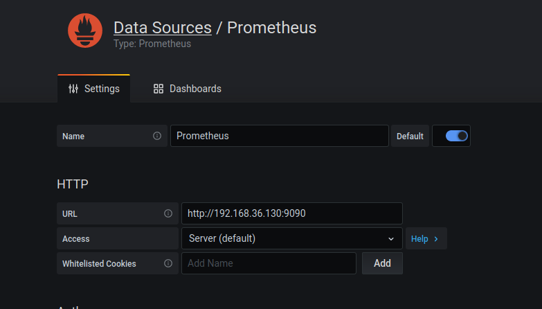

# Monitoring met Prometheus

Voor monitoring zijn een heleboel populaire platformen. Oude bekenden zijn Zabbix, Nagios, Icinga, Check_MK,... Tegenwoordig, in een wereld van containers en service-oriented-architecture is Prometheus zeer prominent aan het worden.

Een opstelling van prometheus bestaat meestal uit 3 belangrijke zaken:
* Een Prometheus-server: deze verzamelt alle data
* 1 of meerdere targets: bieden de data voor een bepaalde service aan
* Een data-visualisatiesysteem: wij zullen hiervoor grafana gebruiken.

## Voorbereiding

In onderstaand voorbeeld vind je dus ook 3 services: een server, een target (cadvisor, een target die data over containers aanbiedt) en een data-visualisatiesysteem. De 2e file is de configuratiefile voor prometheus, waarin je specifieert vanwaar je de data gaat halen.

Je kan onderstaande files kopiëren, of clonen van https://github.com/Tiebevn/BS2_Labo7.

docker-compose.yml
```yml
version: '3.2'
services:
  prometheus:
    image: prom/prometheus:latest
    ports:
      - 9090:9090
    command:
    - --config.file=/etc/prometheus/prometheus.yml
    volumes:
    - ./prometheus.yml:/etc/prometheus/prometheus.yml:ro

  cadvisor:
    image: gcr.io/google-containers/cadvisor:latest
    ports:
      - 8080:8080
    volumes:
    - /:/rootfs:ro
    - /var/run:/var/run:rw
    - /sys:/sys:ro
    - /var/lib/docker/:/var/lib/docker:ro

  grafana:
    image: grafana/grafana
    ports:
      - 3000:3000
    volumes:
      - grafana-storage:/var/lib/grafana


volumes:
  grafana-storage:
  ```
prometheus.yml
  ```yml
  global:
  scrape_interval:     15s
  evaluation_interval: 15s

scrape_configs:
  - job_name: 'prometheus'

    static_configs:
      - targets: ['prometheus:9090']

  - job_name: 'cadvisor'
    static_configs:
      - targets: ['cadvisor:8080']
```

Als je dit allemaal hebt opgestart, zou je op [HOST_IP]:9090 het dashboard van prometheus moeten zien.

## Prometheus verkennen

Wanneer de installatie gelukt is, en je het dashboard van prometheus te zien krijgt, kan je in de navigatiebalk naar Status>Targets navigeren. Hier zou je 2 targets met telkens 1 endpoint moeten zien.


Zoals je ziet komt dit overeen met wat we op voorhand in de configuratiefile hadden gezet. De eerste target, cadvisor, zal eens een heleboel data verzamelen over de containers die op onze host draaien (dankzij de volumes die we eraan hebben gegeven), en in een voor Prometheus leesbare manier aanbieden. Hoe ziet dat er precies uit? Surf eens naar [HOST-IP]:8080/metrics. Dit zal een groot textfile zijn met een heleboel key-value-waarden. Vernieuw deze pagina ee naantal keer en je zal de waarden ook zien veranderen.

Wat doet Prometheus nu precies? Om de 15 seconden (zie prometheus.yml) gaat de Prometheus-server deze data opvragen aan de target, en de data opslaan.

Daarnaast biedt de Prometheus-server ook zelf een aantal metrics aan. Deze vind je onder [HOST-IP]:9090/metrics. Deze gaan vooral over het functioneren van de server zelf.


Hoe vraag je die data nu op? Dat vind je terug onder 'Graph' onder de navigatiebalk.


Hier kan je data opvragen door gebruik te maken van [PromQL](https://prometheus.io/docs/prometheus/latest/querying/basics/), Prometheus Query Language.

Door te klikken op de dropdown-box naast de Execute-knop vind je een hele boel voorbeelden van wat je kan doen. Met de query `prometheus_http_requests_total` kan je bijvoorbeeld counters krijgen van alle http-requests die naar verschillende locaties op de Prometheus-server. Om hierin te filteren kan je bijvoorbeeld `prometheus_http_requests_total{handler="/metrics"}` uitvoeren om enkel de resultaten voor de locatie '/metrics' op de Prometheus-server te zien. Merk op hoe deze syntax overeenkomt met de legende!

## Grafana verkennen

Het Prometheus-dashboard is handig om iets te testen, maar is alles behalve optimaal om data goed te virtualizeren. Hiervoor hebben we Grafana geïnstalleerd. Deze vind je normaal terug op [HOST_IP]:3000.

Wanneer je hiernaartoe surft zal je om een gebruikersnaam en wachtwoord vragen. Standaard is dat admin:admin. Je zal het wachtwoord moeten veranderen hierna.

Eerst en vooral zal je een nieuwe datasource moeten toevoegen. Dit kan je doen onder instellingen. Uiteraard kies je voor een Prometheus-datasource. Als URL gebruik je http://[HOST-IP]:9090. Voor de rest hoef je niets aan te passen, en klik je onderaan op Save & Test



Hierna kan je je eerste dashboard maken. Probeer eens de queries van hierboven te kopiëren in een nieuw paneel op je dashboard. Verken ook zeker eens de opties die je in het paneel rechts aangeboden krijgt, om de data op verschillende manieren te visualiseren. Vergeet zeker niet je paneel op te slaan als je er mee klaar bent!

