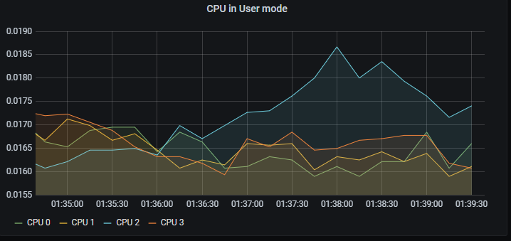
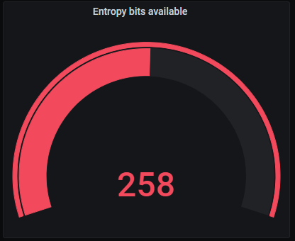
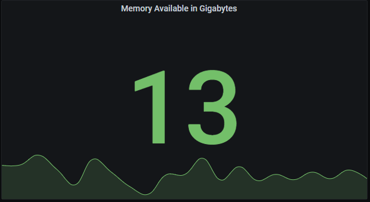
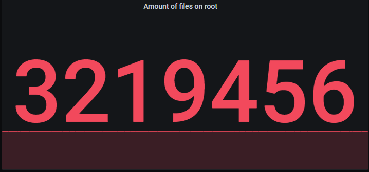
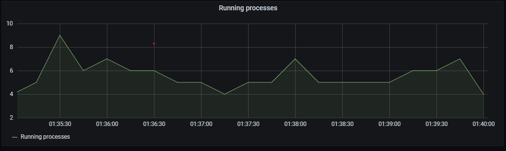

# Opdracht


De opdracht van dit labo is om volgend voorbeeld na te maken. Voor heel dit dashboard wordt gebruik gemaakt van 2 exporters. De node-exporter biedt informatie aan over het host-systeem. De Github-exporter gaat gebruik maken van de Github-API om data over repositories op Github op te halen. Hieronder krijg je de configs om in je Docker-compose file te plaatsen, de Prometheus-configuratie moet je zelf nog toevoegen

[Node-exporter](https://github.com/prometheus/node_exporter)
```yml
node-exporter:
    image: quay.io/prometheus/node-exporter
    ports:
      - 9100:9100
    volumes:
      - /:/host:ro
    command:
      - --path.rootfs=/host
```

[Github-exporter](https://github.com/infinityworks/github-exporter)
```yml
github-exporter:
    image: infinityworks/github-exporter:latest
    ports:
      - 9171:9171
    environment:
      - REPOS=Tiebevn/BS2_Labo7, torvalds/linux
      - GITHUB_TOKEN=YOUR_TOKEN_HERE
```

## Paneel 1: Repository Watchers

Geef een overzicht van de watchers voor enkele repositories. In dit voorbeeld worden de watchers van torvalds/linux en tiebevn/BS2_Labo7 getoond. Dit mogen natuurlijk ook je eigen repositories zijn. Gebruik hiervoor de Github-exporter.


## Paneel 2: Processor in user-mode

Geef in een grafiek de belasting van de verschillende processoren in user-mode weer. (tip: node_cpu_seconds_total)
Dit is een counter, dus je maakt best gebruikt van de `rate()`-operator, en gebruik een interval van 5 minuten. 



## Paneel 3: Entropy bits

Dit paneel spreekt voor zich: weergeef het aantal bits dat beschikbaar zijn voor entropie.



## Paneel 4: Beschikbare Gigabytes aan geheugen

Weergeef het aantal beschikbare GIGABYTES aan geheugen. (tip: node_memory_MemAvailable_bytes)



## Aantal files op de schijf

Weergeef het aantal files dat op het filesystem aanwezig zijn (tip: mountpoint={"/"})


## Aantal actieve (runnende processen)

Ook deze spreekt voorzich: toon het aantal processen dat actief is.


## Indienen

Wat dien je in?
* Een screenshot van je afgewerkte dashboard
* Je prometheus.yml config
* Een tekstbestand met je 6 PromQL-queries